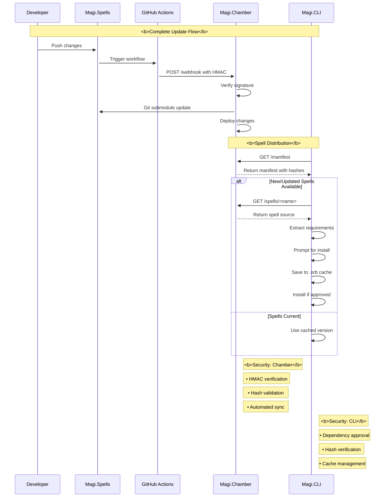

# Magi System Architecture Overview

## Core Components

### 1. Magi.CLI (https://github.com/bobbyhiddn/Magi.CLI)
- Command-line interface for executing spells
- Core command: `cast` serves as universal executor
- Local storage in ~/.sanctum/:
  - `.tome/` for user-created spell macros
  - `.orb/` for spell cache
  - `.runes/` for GUI spell buttons
  - `.aether/` for AI conversation history
  - `.graveyard/` for deleted file recovery
- Built with Python using Click framework

### 2. Magi.Spells (https://github.com/bobbyhiddn/Magi.Spells)
- Central repository for all official spells
- Structured as Python modules with Click commands
- Each spell declares:
  - Dependencies via `__requires__` variable
  - Click command decorator
  - Docstring for description
  - Required alias
- Serves as:
  - Source of truth for official spells
  - Git submodule in Chamber
  - Template for spell structure

### 3. Magi.Chamber (https://github.com/bobbyhiddn/Magi.Chamber)
- Distribution server for spells
- Flask-based REST API with web interface
- Key endpoints:
  ```
  GET /health   - Server status
  GET /spells   - List available spells
  GET /manifest - Get spell versions/hashes
  GET /spells/<name> - Retrieve specific spell
  POST /webhook - Handle spell updates
  ```
- Features:
  - Version control through Git submodule
  - Zero-trust deployment system
  - HMAC webhook verification
  - Self-hostable
  - Bootstrap-based web interface

## Deployment System

### 1. Zero-Trust Update Flow
- Changes to Magi.Spells trigger GitHub Actions
- Webhook calls Chamber with HMAC verification
- Chamber validates and pulls latest spells
- Automated deployment through Fly.io
- Rolling updates for zero downtime

### 2. Self-Hosting Options
- Docker containerization
- Environment variable configuration
- Custom domain support
- Local development environment

## Data Flow

### 1. Spell Updates
```
Developer → Magi.Spells → GitHub Actions → Chamber Webhook → Deployment
```

### 2. Spell Distribution
```
CLI ponder → Chamber API → Local .orb Cache → Installation → Execution
```

### 3. Development Flow
```
Local Development → Magi.Spells PR → Automated Tests → Merge → 
Chamber Webhook → Submodule Update → Auto-deploy
```

## Local Environment

### 1. Configuration
- ~/.sanctum/ as base directory
- Environment variables for API keys
- Local spell storage
- GUI rune persistence

### 2. Caching System
- Spells cached in .orb
- Version checking through manifest hashes
- Local execution from cache
- Relearn capability from cache

### 3. Development
- Local Docker testing
- Automated submodule management
- GitHub Actions integration

## Security

### 1. Zero-Trust Model
- Manifest hash verification
- Dependency declaration and approval
- No implicit trust between components

### 2. Deployment Security
- GitHub Actions secrets
- Environment isolation
- Fly.io security features
- Docker security practices

### 3. User Security
- Local spell validation
- Dependency approval prompts
- Cached spell verification
- Secure API communication

## Future Considerations

### 1. Planned Features
- Local LLM integration for AI spells
- Enhanced GUI functionality
- Spell categories/tags
- Version rollbacks

### 2. Scalability
- Regional deployments
- Load balancing
- Distributed caching
- Performance optimization

### 3. Community
- Spell contribution guidelines
- Documentation improvements
- Community spell repository
- Spell voting system

## System Requirements

### 1. Server
- Python 3.9+
- Flask/Gunicorn
- Docker
- Git

### 2. Client
- Python 3.9+
- Click framework
- Git
- OpenAI API key (optional)

## Diagram

