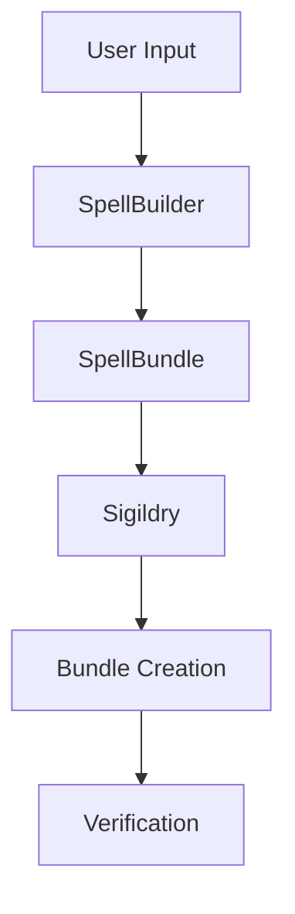
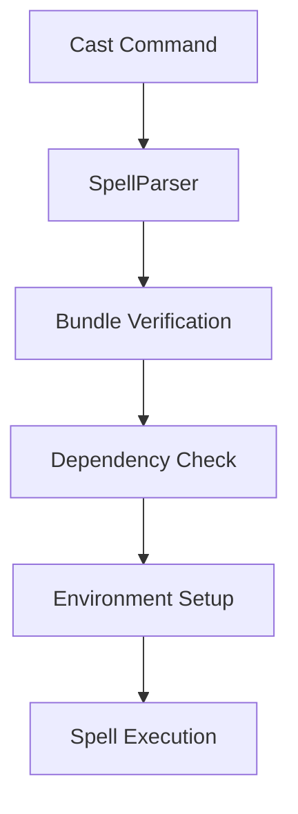

# Spellcraft Loci Technical Documentation

## Overview
The Spellcraft loci system is the core architecture behind spell creation, bundling, and verification in Magi CLI. It consists of three main components: SpellBundle, Sigildry, and SpellParser, all working together to create and manage secure, verifiable spell packages.

## Core Components

### 1. SpellBundle
The central class for creating and managing spell bundles.

#### Key Features
- Creates standardized `.spell` bundles
- Manages spell metadata
- Handles artifact packaging
- Integrates with sigil verification

#### Bundle Structure
```
spell_name.spell/
├── spell/
│   ├── spell.yaml      # Spell configuration
│   └── main.py/main.sh # Entry point
├── artifacts/          # Additional resources
├── spell.json         # Bundle metadata
└── spell_name_sigil.svg # Verification sigil
```

#### Key Methods
- `create_bundle()`: Package a spell directory into a `.spell` bundle
- `extract_bundle()`: Unpack a `.spell` bundle for execution
- `verify_assets()`: Check bundle integrity
- `load_config()`: Parse spell configuration

### 2. Sigildry System
Handles cryptographic verification and visual representation of spells.

#### Features
- Generates unique spell sigils
- Provides cryptographic verification
- Creates visual identifiers
- Manages hash verification

#### Sigil Components
- Runic Sets (Elder Futhark, Younger Futhark, Medieval, Ogham)
- SVG generation
- Hash-based design elements
- Verification metadata

#### Key Methods
- `generate_sigil()`: Create new spell sigil
- `verify_sigil()`: Check sigil authenticity
- `generate_sigil_hash()`: Create unique spell identifier
- `check_spell_conflict()`: Verify spell uniqueness

### 3. SpellParser
Manages spell parsing, execution, and dependency handling.

#### Features
- Parses spell bundles
- Manages dependencies
- Handles execution flow
- Provides error handling

#### Parser Operations
- Bundle verification
- Dependency resolution
- Environment setup
- Execution management

#### Key Methods
- `parse_bundle()`: Extract and validate spell contents
- `execute_spell_file()`: Run spell with proper environment
- `check_dependencies()`: Verify and install requirements
- `find_spell_file()`: Locate spells in the system

## Workflow Integration

### 1. Spell Creation Process


### 2. Spell Execution Flow


## Security Features

### 1. Sigil Verification
- Hash-based integrity checking
- Visual verification elements
- Tampering detection
- Version control

### 2. Dependency Management
- Isolated environments
- Version constraints
- Security checks
- Installation validation

### 3. Execution Safety
- Environment isolation
- Permission management
- Resource constraints
- Error handling

## Implementation Details

### 1. Bundle Creation
```python
class SpellBundle:
    def create_bundle(self, destination_dir: Path) -> Path:
        """Create a spell bundle with verification."""
        # Verify configuration
        config = self.load_config()
        self.verify_assets()
        
        # Generate sigil
        sigil_hash, sigil_path = self._generate_spell_sigil(config)
        
        # Update configuration
        config['sigil_hash'] = sigil_hash
        
        # Create bundle
        bundle_path = destination_dir / f"{config['name']}.spell"
        
        with zipfile.ZipFile(bundle_path, 'w') as zf:
            # Add metadata
            metadata = self._generate_metadata(config)
            zf.writestr('spell.json', json.dumps(metadata))
            
            # Add spell contents
            self._add_spell_contents(zf)
            
            # Add sigil
            zf.write(sigil_path, sigil_path.name)
            
        return bundle_path
```

### 2. Sigil Generation
```python
class Sigildry:
    def generate_sigil(self, hash_input: str, output_path: Path) -> None:
        """Generate a spell sigil SVG."""
        # Create SVG canvas
        dwg = svgwrite.Drawing(output_path, size=(256, 256))
        
        # Generate design elements from hash
        params = self._hash_to_params(hash_input)
        
        # Add visual elements
        self._generate_outer_rim(dwg, hash_input)
        self._generate_starburst(dwg, hash_input, params)
        self._generate_center_rune(dwg, hash_input)
        
        # Save sigil
        dwg.save()
```

### 3. Spell Execution
```python
class SpellParser:
    def execute_spell_file(self, spell_name: str, *args, verbose: bool = False) -> bool:
        """Execute a spell with proper environment setup."""
        try:
            # Locate and parse spell
            spell_path = self.find_spell_file(spell_name)
            temp_dir, metadata = self.parse_bundle(spell_path)
            
            # Verify sigil
            if not self.verify_sigil(spell_path):
                raise SecurityError("Invalid spell sigil")
            
            # Check dependencies
            if not self.check_dependencies(metadata.get('dependencies', {})):
                raise DependencyError("Missing requirements")
            
            # Execute spell
            return self._run_spell(temp_dir, metadata, args)
            
        except Exception as e:
            if verbose:
                self._log_error(e)
            return False
```

## Best Practices

### 1. Spell Creation
- Use clear, descriptive names
- Include comprehensive metadata
- Bundle required artifacts
- Verify dependencies
- Test thoroughly

### 2. Security
- Always verify sigils
- Check dependencies
- Use isolation
- Handle errors gracefully
- Validate inputs

### 3. Performance
- Minimize bundle size
- Optimize dependency usage
- Cache when appropriate
- Clean up resources
- Handle timeouts

## Future Considerations

### 1. Planned Features
- Enhanced dependency resolution
- Improved isolation
- Better error reporting
- Performance optimization
- Extended security features

### 2. Scalability
- Remote spell execution
- Distributed verification
- Cloud integration
- Load balancing
- Resource management